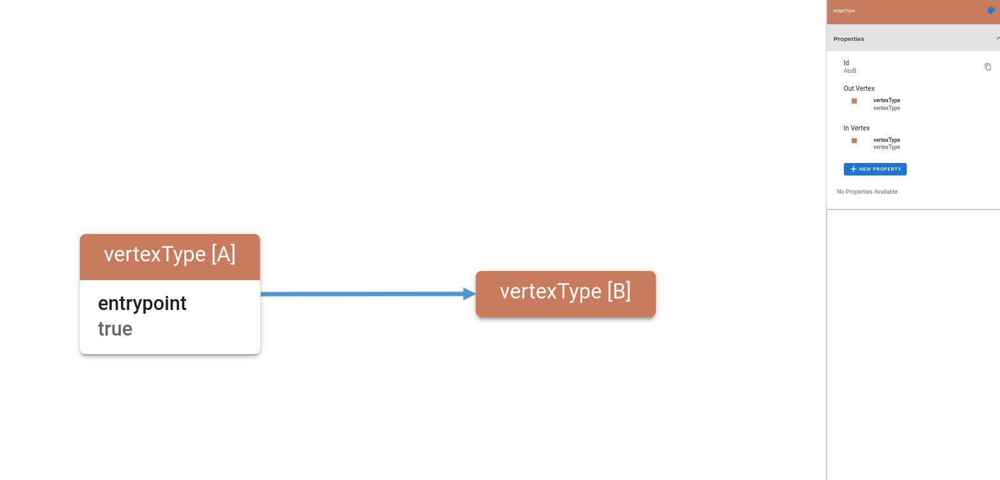

A schema graph, or meta graph, is a graph that captures and encodes the structure, properties, 
types and ranges of values of another graph.

A schema graph is very similar to a UML diagram.
The DDL for the Schema Graph is the Gremlin language.

Lets start with the simplest schema: 

(Vertex A) -(Edge E)-> (Vertex B)

In YAML format, this looks like:
```yaml
entrypointVertexType: A

vertexTypes:

  - name: A
    outEdges:
      - name: AtoB
        likelihood: 1.0
        chancesToCreate: 1
    properties: []

  - name: B
    outEdges: []
    properties: []

edgeTypes:

  - name: AtoB
    inVertex: B
    outVertex: A
    properties: []
```
Now, lets see what the schema graph diagram looks like:


How would we define this in gremlin?
```groovy
g.addV('vertexType')
  .as('A')
  .property(single, 'entrypoint', true)
  .addV('vertexType')
  .as('B')
  .addE('edgeType').from('A').to('B')
```
Pretty straightforward.

Lets start from an empty Graph, define a schema, then generate some data.


